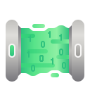
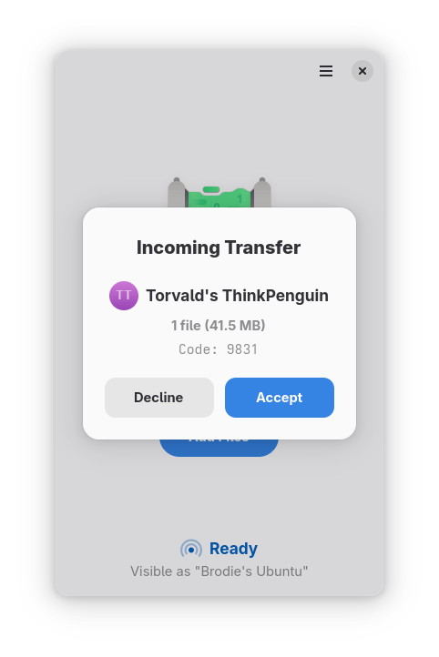

#  Packet

An implementation of the Google Quick Share protocol to send and receive files to Android devices or another instance of Packet.

    

## Installation

#### Nightly
Nightly Flatpak builds are available from [here](https://nightly.link/nozwock/packet/workflows/ci/main?preview).

## Requirements
Packet requires Bluetooth to be enabled and the devices to be connected to a Wi-Fi network with mDNS.

## Translations
You can help translate Packet into your native language. If you found any typos or think you can improve a translation, you can use the [Weblate](https://hosted.weblate.org/projects/packet/) platform.

## Acknowledgments
- [NearDrop](https://github.com/grishka/NearDrop/)
- [rquickshare](https://github.com/Martichou/rquickshare/)
