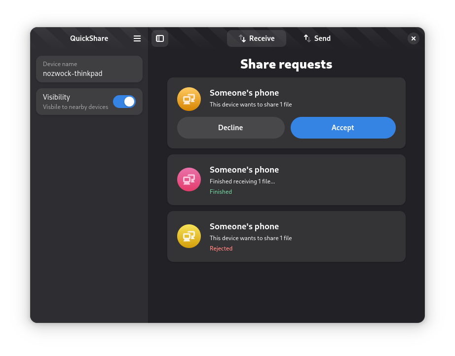

#  Packet

An implementation of Android's NearbyShare/QuickShare for Linux with a GTK4 interface.

    

## Installation
Packet is available as a flatpak.

<!-- FIXME Uncomment once published at Flathub -->
<!-- #### Flathub -->
<!-- Packet is available on Flathub! -->
<!-- <a href="https://flathub.org/apps/details/io.github.nozwock.QuickShare"> -->
<!--  -->
<!-- </a> -->

#### Nightly
Nightly flatpak builds are available from [here](https://nightly.link/nozwock/quickshare-gtk/workflows/ci/main?preview).

<!-- FIXME Uncomment once pot/po files are in-place and tested -->
<!-- ## Translations -->
<!-- Helping to translate Packet or add support to a new language is very -->
<!-- welcome. You can find everything you need at: -->
